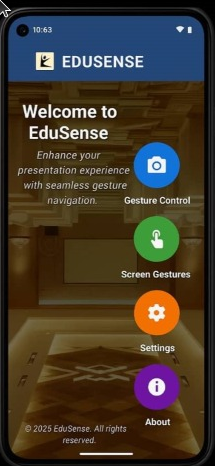

# EduSense

## Overview
EduSense is a gesture-controlled mobile application designed to enhance slide presentations by allowing users to control slides on a PC using hand gestures or on-screen swipes. Built with Flutter, it leverages Google MediaPipe for gesture recognition and communicates with a Python server on the PC via WebSockets to execute slide navigation commands using the PyAutoGUI library. The app aims to provide a seamless, hands-free presentation experience for educators and professionals.

## Features
- **Gesture Control**: Navigate slides (next, previous, start, stop) using hand gestures detected by the phone's front camera.
- **Swipe Control**: Use on-screen swipes for slide navigation, ideal for poor lighting conditions.
- **WebSocket Communication**: Real-time command transmission between the mobile app and PC server over a Wi-Fi network.
- **User Authentication**: Secure login via Firebase with email/password or Google sign-in.
- **Action Logging**: Logs user actions (gestures, swipes) for debugging and performance analysis.
- **URL Launching**: Open presentation files or external resources directly from the app.

## Requirements
### Mobile App
- **Platform**: Android 8.0+ or iOS 12.0+
- **Hardware**: Smartphone with a front-facing camera
- **Framework**: Flutter
- **Dependencies**: Google MediaPipe for gesture recognition, Firebase for authentication

### PC Server
- **Platform**: Windows 10/11 or macOS 10.15+
- **Software**: Python 3.8+, PyAutoGUI library
- **Network**: Stable Wi-Fi connection for WebSocket communication

## Installation
1. **Mobile App**:
   - Clone the repository: `git clone https://github.com/Group32/EduSense.git`
   - Navigate to the project directory: `cd EduSense`
   - Install Flutter dependencies: `flutter pub get`
   - Run the app: `flutter run`
2. **Python Server**:
   - Install Python 3.8+ on your PC.
   - Install required libraries: `pip install pyautogui websocket-server`
   - Run the server: `python server.py`
   - Ensure the PC and mobile device are on the same Wi-Fi network.

## Usage
1. Launch the Python server on your PC.
2. Open the EduSense app on your mobile device.
3. Log in using Firebase authentication (email/password or Google sign-in).
4. Connect to the PC server by entering the WebSocket address provided by the server.
5. Use hand gestures (e.g., wave right for next slide, wave left for previous slide) or on-screen swipes to control your presentation.
6. Access in-app help for gesture and setup instructions.

## System Architecture
- **Mobile App**: Built with Flutter, uses Google MediaPipe for gesture detection and communicates via WebSockets.
- **PC Server**: Python-based, uses PyAutoGUI to control presentation software (e.g., PowerPoint, Google Slides).
- **Communication**: WebSocket protocol over Wi-Fi, sending JSON messages (e.g., `{"command": "next_slide"}`).

## Non-functional Requirements
- **Performance**:
  - Gesture detection: Processes within 100 ms per frame.
  - WebSocket commands: Transmitted within 50 ms.
  - App load time: Main screen loads within 2 seconds after login.
- **Reliability**: 99% uptime during presentations with a stable Wi-Fi connection.
- **Security**: Firebase authentication, encrypted local storage for user preferences.
- **Portability**: Supports Android 8.0+, iOS 12.0+, Windows 10/11, and macOS 10.15+.

## Development Constraints
- Uses Flutter for cross-platform compatibility.
- Gesture recognition limited to predefined hand gestures via Google MediaPipe.
- WebSocket communication currently unencrypted; future versions may implement TLS.

## Screenshots

## Demo
Check out the EduSense demo video: [YouTube Demo](https://youtu.be/NqOs-AQkacI?si=hpzzKALl1OEmbvy7)

## Contributing
Contributions are welcome! Please follow these steps:
1. Fork the repository.
2. Create a new branch: `git checkout -b feature-name`
3. Commit your changes: `git commit -m 'Add feature-name'`
4. Push to the branch: `git push origin feature-name`
5. Submit a pull request.

## License
This project is licensed under the MIT License. See the [LICENSE](LICENSE) file for details.

## Acknowledgments
- **Flutter Documentation**: https://flutter.dev/docs
- **Google MediaPipe**: https://mediapipe.dev
- **PyAutoGUI Documentation**: https://pyautogui.readthedocs.io/
- **WebSocket Protocol**: RFC 6455
- **IEEE Citation Guide**: https://www.ieee.org/documents/ieeecitationref.pdf

## Contact
For inquiries, contact Group 32 via the course facilitator or open an issue on the GitHub repository.
