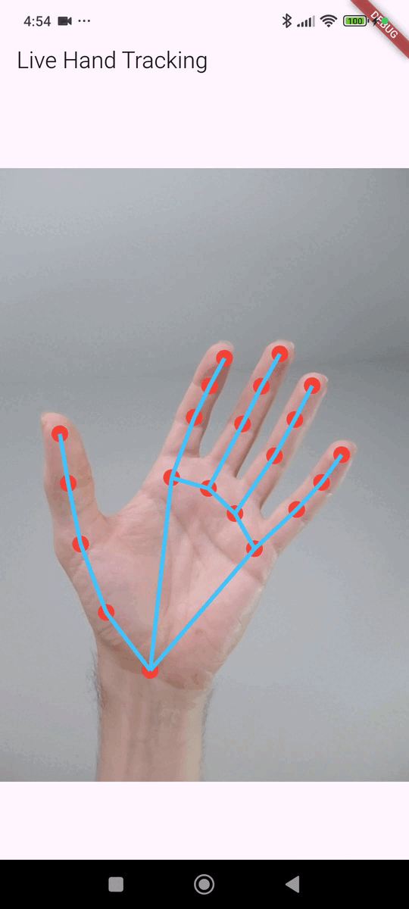

# Hand Gesture

This is my Flutter hand gesture control project integrating the Hand Landmarker plugin.

## Demo



## Purpose

This app demonstrates:

- Initializing the hand_landmarker plugin.
- Processing a live camera feed using the camera package.
- Receiving hand landmark data from the plugin.
- Rendering results on screen with a CustomPainter.

It serves as a practical reference for gesture-based control projects.

## How to Run

1. **Install dependencies:**

   ```bash
   flutter pub get
